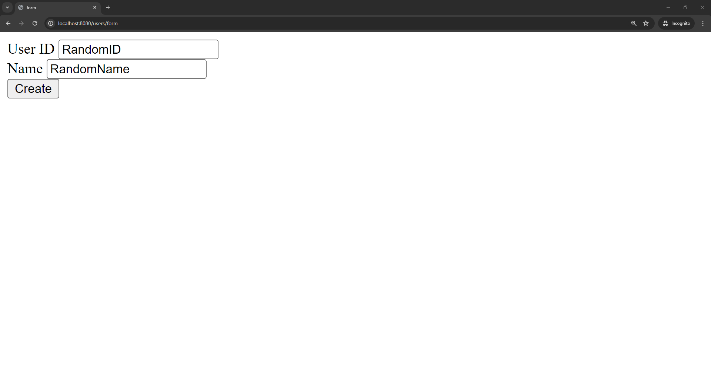

# Custom MVC Framework

This project is a lightweight MVC framework inspired by the Spring Web MVC architecture. It demonstrates how to handle client requests using the Front Controller design pattern.

## ✨ Features

- Built using the **Front Controller Pattern**, where a single `DispatcherServlet` acts as the entry point for all client requests—just like Spring's DispatcherServlet.
- Routes client requests to the appropriate controller and returns a corresponding view (JSP).

## 🛠️ Tech Stack

- Java
- Gradle
- Tomcat
- Servlet API
- Reflections Library

## 🔄 Request Handling Flow

1. The **client** sends a request, which is received by the **DispatcherServlet**.
2. The **DispatcherServlet** calls the **HandlerMapping** and passes the request information. It analyzes the request URL to find the appropriate **Controller**.
3. Next, the **DispatcherServlet** calls the **HandlerAdapter**, which looks for the suitable method within the selected controller that matches the request URL.
4. The **HandlerAdapter** delegates the request to the **Controller**. The controller processes the business logic and stores the results in a **Model** object to be used by the view.
5. The **Controller** returns the name of the view to the **DispatcherServlet**.
6. The **DispatcherServlet** calls the **ViewResolver**, which maps the view name returned by the controller to the actual **View**.
7. The **DispatcherServlet** passes the model data to the **View** to render the final output.
8. The **View** accesses the data in the **Model** needed to generate the response, renders the output (e.g., JSP page), and sends it back to the **client**.

## 🧩 Core Components Explained

### DispatcherServlet
The `DispatcherServlet` is the front controller in Spring MVC. It acts as the main entry point of the web application, handling all incoming client requests.

It is typically configured via `web.xml` or through a `WebApplicationInitializer`. Upon receiving a request, it delegates the request to the appropriate controller for processing.

### HandlerMapping
`HandlerMapping` is responsible for identifying the appropriate controller based on the incoming request's URL. It maps the request to a handler (controller) that can process it.

This mapping can be configured using XML or Java annotations.

### HandlerAdapter
The `HandlerAdapter` is responsible for invoking the appropriate method within the mapped controller. It adapts different types of controllers into a common interface so that they can be handled uniformly.

It then returns the result as a `ModelAndView` object, which includes both the model data and the view name.

### Controller
A `Controller` handles client requests by executing business logic and populating a `Model` with the result. It then returns the name of the view to be rendered.

Controllers are typically implemented as Java classes and are registered with Spring using the `@Controller` annotation.

### ViewResolver
The `ViewResolver` maps the view name returned by the controller to an actual `View` implementation. This allows the application to determine which view should be rendered and returned to the client.

Spring supports many types of view templates, and the `ViewResolver` locates the correct one.

### View
The `View` is responsible for rendering the user interface. It uses the model data provided by the controller to generate the final output seen by the client.

Views are usually implemented with technologies like JSP, HTML, or Thymeleaf.

## 📚 Key Concepts Learned

### Forward vs. Redirect

- **Forward**: Passes the request to another servlet internally (without going through the client again). The same `HttpServletRequest` is reused.
- **Redirect**: Sends the response back to the client, which then issues a new request. A new `HttpServletRequest` and `HttpServletResponse` are created.

## 🗺️ Framework Diagram

## 📸 Screenshots

- **Home Page** – `HomeController` (`localhost:8080`)
  

- **User Form Page** – `ForwardController` (`localhost:8080/user/form`)
  

- **User List Page** – `UserListController` (`localhost:8080/users`)
  
